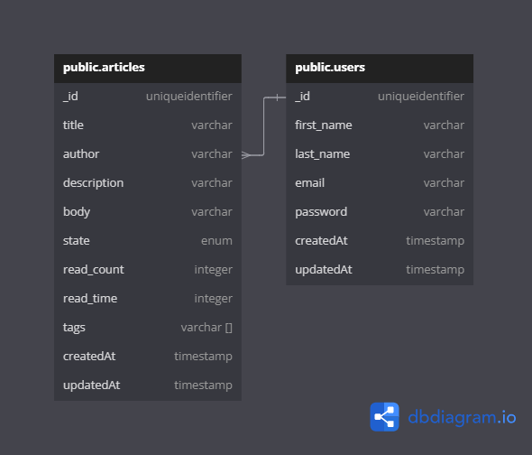

### Welcome to the Blog API

## Render Link

[Visit](https://blog-api-3mtt.onrender.com)

# API Routes Not Requiring Authentication

- GET All Articles `/articles`
- GET A Single Article `/articles/:id`

- POST Register an Account `/auth/register`
- POST Login `/auth/ogin`

# API Routes Requiring Authentication

- GET All posts from author `/articles/author/:id`
- POST Create an Article `/articles`
- PATCH Update an Article created by you `/articles/:id`
- DELETE An article created by you `/articles/:id`

# Entity Relationship Diagram (ERD)



# Fields for POST Request

```
REGISTER

{
"first_name": "Emmanuel",
"last_name": "Doe",
"email": "emmanuel@gmail.com",
"password": "12345678"
}
```

```
LOGIN
    {
"email": "emmanuel@gmail.com",
"password": "12345678"
}
```

```
Create Blog Article
{
  "title": "My First Blog Post",
  "description": "Lorem ipsum dolor sit amet, consectetur adipiscing elit.",
  "body": "Lorem ipsum dolor sit amet, consectetur adipiscing elit. Sed do eiusmod tempor incididunt ut labore et dolore magna aliqua.",
  "tags": ["Lorem", "Ipsum", "Dolor"]
}
```


